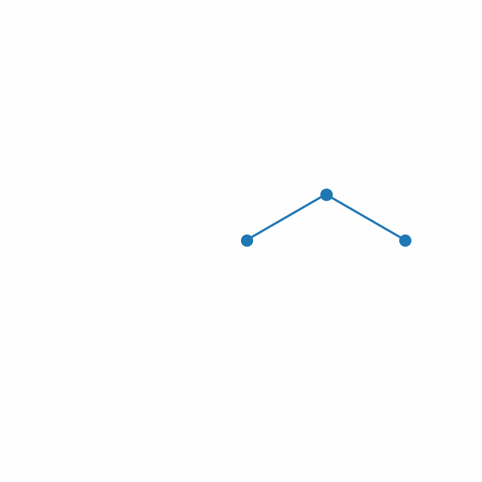

# Constrained-Forward-Dynamic-Simulation-of-Multi-Links 

## Introduction
This project provided classes of modeling open and closed loop uniformly distributed mass serial links. Modeling based on Lagrangian methods with constrained generalized coordinates. Equations of Motion (EOM) are computed sybolically with sympy. EOMs can be manipulated into three different forms of state space models:

1. Eliminate Lagrangian multipliers.
2. Approximate constrains as springs.
3. Null space.

Double Pendulum | Triple Pendulum | Quadruple Pendulum | Four-bar | Deca Pendulum
--------------- | --------------- | ------------------ | -------- | -------------
 |  |  |  | 

Jupyter notebook demo with interactive animation in [scripts](/scripts)

Add gifs and video demos in [imgs](/imgs)

Brief [intro](Serial_links.pdf)
