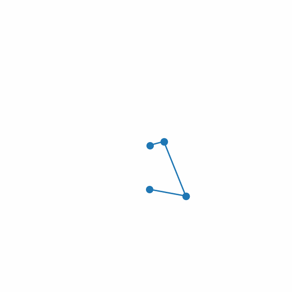

# Constrained-Forward-Dynamic-Simulation-of-Multi-Links 
Numerical Methods Course Project

Jupyter notebook demo with interactive animation in [scripts](/scripts)

Add gifs and video demos in [imgs](/imgs)

Brief intro [intro](Serial_links.pdf)

Double Pendulum | Triple Pendulum | Quadruple Pendulum | Four-bar
--------------- | --------------- | ------------------ | --------
 |  |  | 

Deca Pendulum

