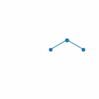
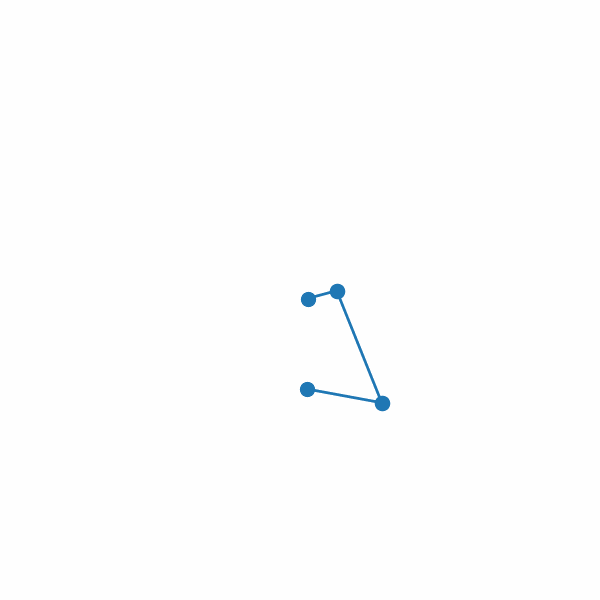

## Introduction
This project provided classes of modeling open and closed loop uniformly distributed mass serial links. Modeling based on Lagrangian methods with constrained generalized coordinates. Equations of Motion (EOM) are computed sybolically with sympy. EOMs can be manipulated into three different forms of state space models:

1. Eliminate Lagrangian multipliers.
2. Approximate constrains as springs.
3. Null space.

Provided initial condition solver, constrained force, torque and motion can be calculated with ODE solvers. 

Comapare performance of different methods and ode solvers in terms of computational cost and accuracy. A brief presentation including modeling details and results can be found [here](https://github.com/ylin62/Constrained-Forward-Dynamic-Simulation-of-Multi-Links/blob/gh-pages/Serial_links.pdf).

[Double Pendulum](https://github.com/ylin62/Constrained-Forward-Dynamic-Simulation-of-Multi-Links/blob/gh-pages/scripts/ExplicitModel_Double_Pendulum.ipynb) | [Triple Pendulum](https://github.com/ylin62/Constrained-Forward-Dynamic-Simulation-of-Multi-Links/blob/gh-pages/scripts/ExplicitModel_Triple_Pendulum.ipynb) | [Quadruple Pendulum](https://github.com/ylin62/Constrained-Forward-Dynamic-Simulation-of-Multi-Links/blob/gh-pages/scripts/ExplicitModel_Quadruple_Pendulum.ipynb) | [Four-bar](https://github.com/ylin62/Constrained-Forward-Dynamic-Simulation-of-Multi-Links/blob/gh-pages/scripts/ExplicitModel_Fourbar.ipynb) | [Deca Pendulum](https://github.com/ylin62/Constrained-Forward-Dynamic-Simulation-of-Multi-Links/blob/gh-pages/scripts/ExplicitModel_Deca_Pendulum.ipynb)
--------------- | --------------- | ------------------ | -------- | -------------
 |  |  |  | 

Jupyter notebook demo with interactive animation in [scripts](https://github.com/ylin62/Constrained-Forward-Dynamic-Simulation-of-Multi-Links/tree/gh-pages/scripts)

Gifs and video demos in [imgs](https://github.com/ylin62/Constrained-Forward-Dynamic-Simulation-of-Multi-Links/tree/gh-pages/imgs)

## Demo with Lagrangian multipliers

Double Pendulum
<video src="imgs/DoublePendulum.mp4" width="800" height="450" controls></video>

Tripple Pendulum
<video src="imgs/TriplePendulum.mp4" width="800" height="450" controls></video>

FourBar
<video src="imgs/Fourbar.mp4" width="800" height="450" controls></video>

Deca Pendulum
<video src="imgs/DecaPendulum.mp4" width="800" height="450" controls></video>

<!-- ### Jekyll Themes

Your Pages site will use the layout and styles from the Jekyll theme you have selected in your [repository settings](https://github.com/ylin62/Constrained-Forward-Dynamic-Simulation-of-Multi-Links/settings). The name of this theme is saved in the Jekyll `_config.yml` configuration file.

### Support or Contact

Having trouble with Pages? Check out our [documentation](https://docs.github.com/categories/github-pages-basics/) or [contact support](https://support.github.com/contact) and we’ll help you sort it out. -->
